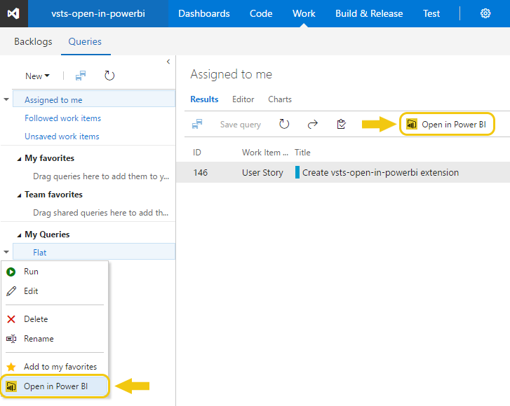

# Open in Power BI

Use this extension to create stunning reports in Power BI based on the Work Item Queries saved in Team Services. You can configure your reports to be refreshed daily to make sure your picture is always up to date. When you modify your Query by adding extra filters or columns these changes will be automatically reflected in Power BI upon next refresh.

### Open saved Queries in Power BI
There are two ways you can open a query. First, you can click "Open in Power BI" toolbar button visible above query result table. Second, you can right-click on a query under "My Queries" or "Shared Queries" and select "Open in Power BI" menu item. In both cases the effect will be the same and a Power BI file will be available for download. Once opened, you will have to click "Refresh" to load the data.

